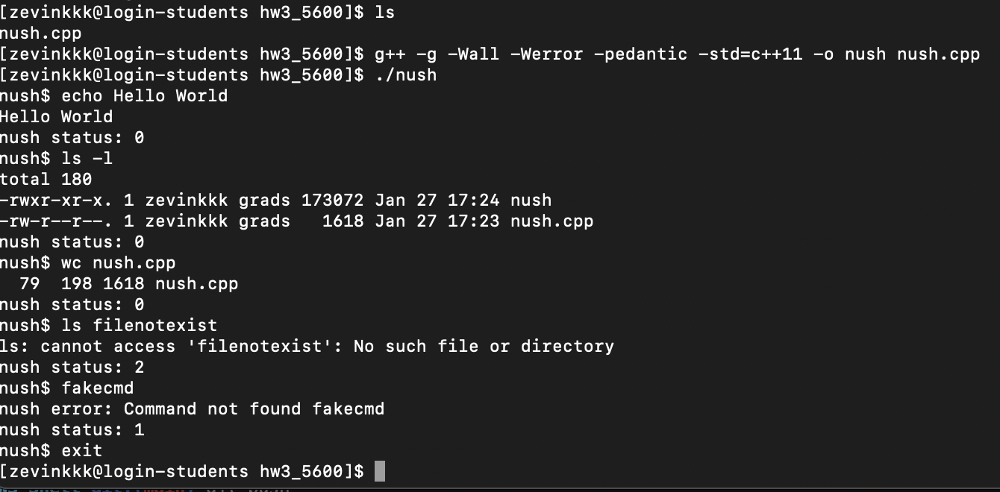

# CS5600_HW3_Shell
This repo is designed for the hw3 in 5600

Name: Zewen Li & Ziqiao Shen

Instructions:
1. Compile the program using:
   g++ -g -Wall -Werror -pedantic -std=c++11 -o nush nush.cpp
2. Run the program using:
   ./nush

Test Cases:
- ls
- ls -l
- wc nush.cpp
- echo Hello World
- ls filedoesnotexist
- fakecmd
- exit

Known Issues:
- The shell does not support input/output redirection or pipes.

Execute Example:

